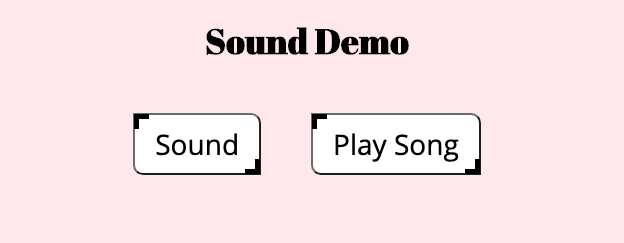
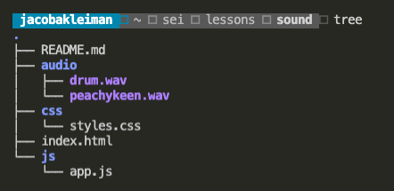

# How to use Audio in Javascript



## Instructions
Link two audio files to event listeners, and play audio when event fires.
Toggle pause and play audio.

### Setup 

- Create an audio folder and hold all your audio files within it. Create it in the same directory as your `index.html`.




### Declare Audio Object
- Create variables to store objects of the `Audio` class.

 ```javascript
// Get Audio (.mp3, .wav)
let sound = new Audio('audio/sound.wav');
 ```

### Audio Object Methods
- You can tell the browser to render your audio by using `.play()`
 ```javascript
// Play audio
sound.play();
// Pause audio
sound.pause();
 ```
 <em>If you're using an audio file format different from .mp3 or .wav, you can use `canPlayType()` which checks whether the browser can play the specified audio type.</em>

### Using Audio with Event Listeners
- The following code snippets shows you how to play audio from a button click: 
 ```javascript
let sound = new Audio('audio/sound.wav');
let soundBtn = document.querySelector('button');
soundBtn.addEventListener("click", () => sound.play());
 ```

### Playing and Pausing Audio Toggle Button
For this example I used a song from my highly esteemed band, <strong>Peachy Keen</strong>.
To tell if a song is paused, we will use the object property `.paused`, a boolean value.

```javascript
// Create the audio object
let song = new Audio('audio/peachykeen.wav');
// Select the button with id song
let songBtn = document.querySelector('#song');
// Add click event listener
songBtn.addEventListener("click", playSong);

// Define the playSong function
function playSong() {
    // Play the song
    song.play();
    // Remove the playSong event listener
    songBtn.removeEventListener("click", play);
    // Add the toggle event listener
    songBtn.addEventListener("click", toggleSong);
    // Change the button text
    songBtn.innerHTML="Pause Song"
}

// Define the toggle function
function toggleSong() {
    if (song.paused) {
        song.play();
        songBtn.innerHTML = "Pause Song"
    }
    else {
        song.pause();
        songBtn.innerHTML = "Play Song"
    }
}
```